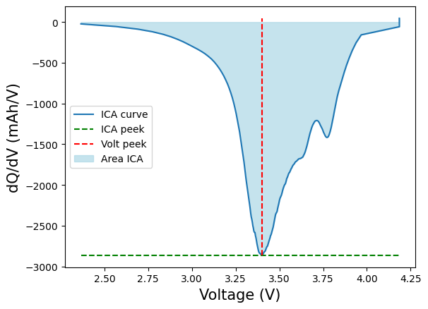
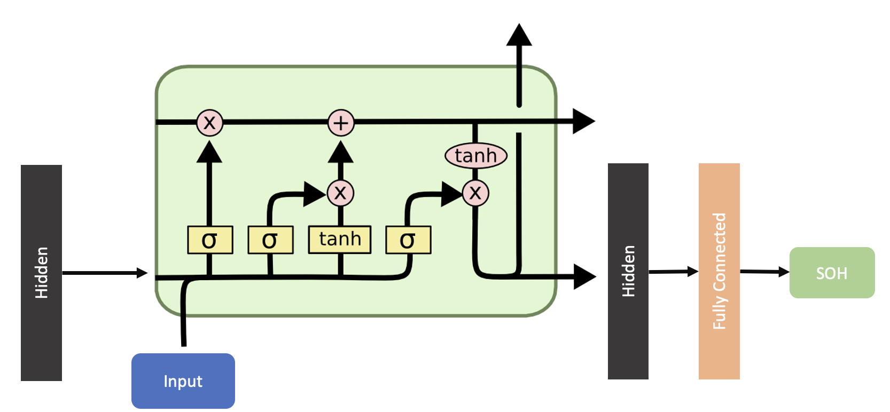

# Towards-Optimal-BMS-Design-LSTM-Based-State-of-Health-Estimation-from-Raw-Operational-Data

State of Health (SoH) is one of the key indicators of lithium-ion battery performance, defined as the ratio of the remaining capacity to the initial nominal capacity. Accurate SoH estimation is crucial for Battery Management Systems (BMS), ensuring reliability, safety, and timely replacement of batteries in electric vehicles and other applications.

This repository contains the implementation of experiments on SoH prediction using the **NASA Prognostics Center of Excellence dataset**. The dataset includes cycling data of lithium-ion cells with nominal capacity of 2 Ah, providing measurements such as voltage, current, temperature, capacity, and time across charge/discharge cycles. 

In addition to raw BMS data, we also tested features derived from **Incremental Capacity Analysis (ICA)**. ICA is a common diagnostic technique where the derivative of capacity with respect to voltage (dQ/dV) is analyzed to extract degradation-sensitive features such as peak value, peak position, and area under the curve.

#### ICA example:

## Methods  
We evaluated two main machine learning models:  
- **Gradient Boosting Trees (GBT):** applied both to raw flattened time-series data and to ICA features.  
- **Long Short-Term Memory networks (LSTM):** applied directly to sequential raw BMS data.  

We also tested hybrid approaches:  
- **GBT on hidden states from LSTM** (using the LSTM memory representations as features)  
- **GBT on ICA features combined with LSTM outputs**

#### LSTM network

### Results
- **LSTM on raw BMS data** achieved the best accuracy with **RMSE = 1.27**, clearly outperforming all other approaches.  
- Adding ICA features to LSTM degraded performance (**RMSE = 1.71**).  
- **GBT on raw flattened BMS data** gave poor accuracy (**RMSE = 3.40**) due to the loss of temporal structure.  
- **GBT on ICA features** performed moderately (**RMSE = 2.78**).  
- **GBT on hidden states from LSTM** (using memory representations as features) resulted in **RMSE = 3.36**.  
- **GBT on hidden states + ICA features** slightly improved to **RMSE = 2.71**, but still lagged far behind LSTM.  
- Combining raw data with ICA or hybrid GBT+LSTM methods did not yield improvements, often worsening results.  

## Conclusions
 LSTM directly applied to raw BMS data provides the most reliable and accurate SoH estimation. ICA features and hybrid approaches do not add value for this task.

---

## References
- Dataset: [Dataset on Kaggle](https://www.kaggle.com/datasets/patrickfleith/nasa-battery-dataset)  
